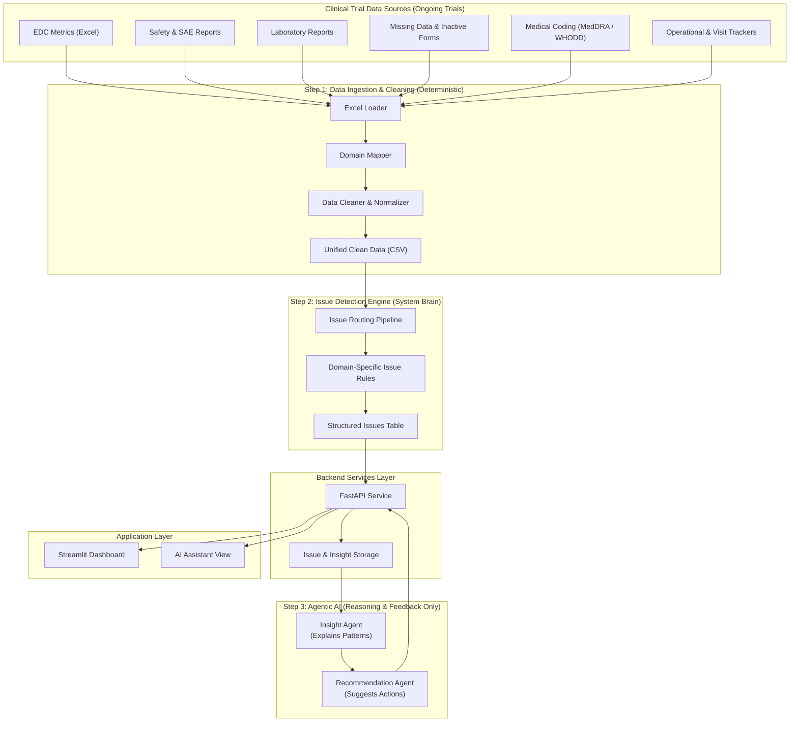

# TrailFlow


## Overview

TrailFlow is an **agentic AI–driven clinical trial intelligence platform** that ingests heterogeneous clinical trial data, detects issues using deterministic logic, and applies AI reasoning to generate insights, recommendations, and summaries.

The system is designed to mirror real-world clinical operations, where **data quality, safety, and operational risks** must be detected early and explained clearly.

---

## Problem Statement

Clinical trial data is fragmented across multiple siloed systems, including:

- EDC metrics  
- Safety and SAE reports  
- Laboratory outputs  
- Operational and visit trackers  

Manual monitoring of these systems is **reactive, slow, and error-prone**, increasing the risk of delayed decisions, audit findings, and operational inefficiencies.

TrailFlow addresses this by unifying data sources, automatically detecting issues, clearly explaining their impact, and recommending corrective actions.

---

## Key Capabilities

- **Deterministic data ingestion and cleaning**
- **Domain-aware issue detection**
  - Data quality
  - Safety
  - Operations
  - Medical coding
- **Agentic AI reasoning for**
  - Pattern explanation
  - Risk interpretation
  - Actionable recommendations
  - Study-level summaries
- **Clear separation between**
  - Rule-based logic
  - AI-driven reasoning
- **Extensible and production-aligned architecture**

## Project Structure

<h2>Project Structure</h2>
<pre><code>
TrailFlow/
├── data/
│   └── raw/                         # Raw, unprocessed clinical trial datasets
│
├── ingestion/
│   ├── loader.py                    # Excel / file loading logic
│   ├── domain_mapper.py             # Maps files to clinical domains
│   ├── cleaner.py                   # Generic & domain-specific data cleaning
│   ├── pipeline.py                  # Orchestrates ingestion workflow
│   └── test_loader.py               # Unit tests for loader logic
│
├── issue_model/
│   ├── issue_detector.py            # Core issue detection engine
│   ├── rules.py                     # Rule-based issue detection logic
│   ├── features.py                  # Feature extraction for issue signals
│   ├── schemas.py                   # Standardized issue output schemas
│   └── __init__.py
│── agents/
│   ├── insight_agent.py              # Converts detected issues into insights
│   ├── recommendation_agent.py      # Generates action items & mitigation steps
│   ├── summarization_agent.py        # High-level study summaries
│   └── __init__.py
|
├── run_pipeline.py                  # Main pipeline entry point
├── requirements.txt                 # Python dependencies
├── .gitignore                       # Git ignore rules
├── run_ai_pipeline.py               # Runs full AI pipeline (issues → insights → actions)
├── test_loader.py
├── run_issue_pipeline.py
└── README.md                        # Project documentation
</code></pre>

## How It Works

1. Raw datasets are placed inside the `data/raw/` directory.
2. Ingestion modules read and validate the input data.
3. The pipeline is triggered using `run_pipeline.py`.
4. Each stage is executed in a controlled and reproducible manner.

## Usage

Run the pipeline from the project root:

```bash
python run_pipeline.py
```

Run the full AI pipeline for the project:
```bash
python run_ai_pipeline.py
```

This script orchestrates the complete workflow and serves as the central execution point for the project.
## Design Principles

- Deterministic logic before AI reasoning  
- No black-box decisions  
- Fully traceable issue origins  
- Modular and testable components  
- Built for real-world clinical workflows  

---

## Current Status

- Ingestion pipeline implemented  
- Issue detection engine operational  
- Agentic AI layer integrated  
- End-to-end execution supported  

---

## Future Enhancements

- Configuration-driven rules  
- Continuous ingestion support  
- Monitoring and alerting  
- Cross-study intelligence  
- Cloud-native deployment  

 
