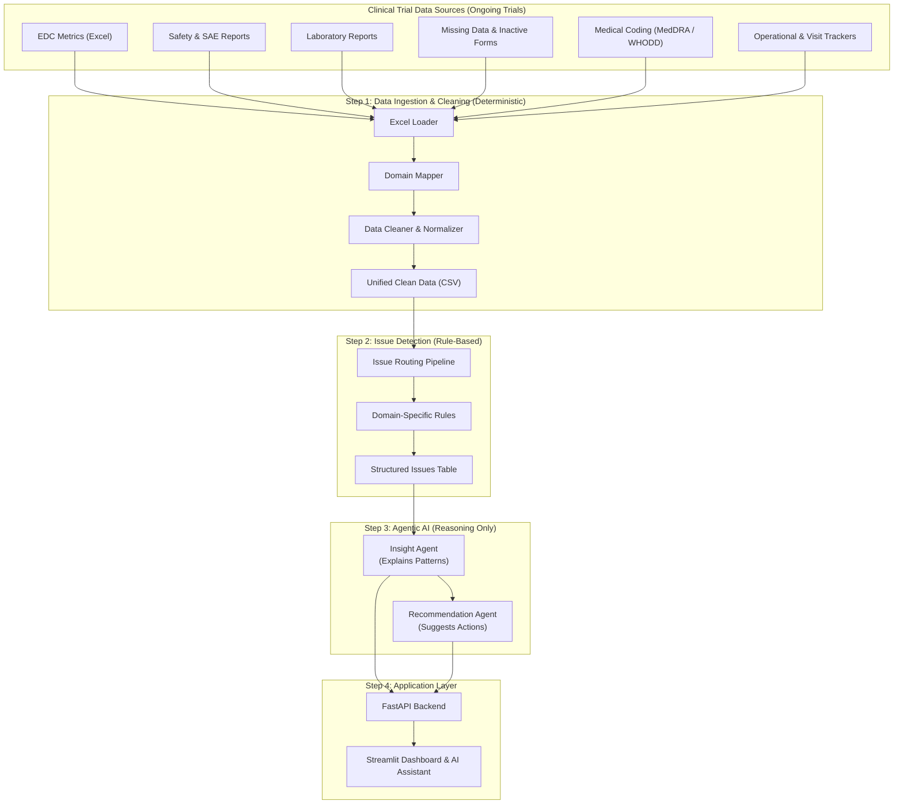

# TrailFlow

## System Design


## Overview

TrailFlow is a Python-based data ingestion and processing pipeline designed to load, organize, and process structured datasets in a clean and reproducible way.  
The project follows a modular architecture, making it easy to extend, test, and integrate into larger data or machine learning workflows.

TrailFlow focuses on clarity, maintainability, and scalability, making it suitable for experimentation, research workflows, and early-stage production pipelines.

## Key Features

- Modular data ingestion layer for clean separation of concerns  
- Centralized pipeline execution through a single entry point  
- Clean and organized project structure  
- Support for structured raw data storage  
- Testable ingestion components  
- Lightweight and easy to extend for new pipeline stages  

## Project Structure

<h2>Project Structure</h2>
<pre><code>
TrailFlow/
├── data/
│   └── raw/                         # Raw, unprocessed clinical trial datasets
│
├── ingestion/
│   ├── loader.py                    # Excel / file loading logic
│   ├── domain_mapper.py             # Maps files to clinical domains
│   ├── cleaner.py                   # Generic & domain-specific data cleaning
│   ├── pipeline.py                  # Orchestrates ingestion workflow
│   └── test_loader.py               # Unit tests for loader logic
│
├── issue_model/
│   ├── issue_detector.py            # Core issue detection engine
│   ├── rules.py                     # Rule-based issue detection logic
│   ├── features.py                  # Feature extraction for issue signals
│   ├── schemas.py                   # Standardized issue output schemas
│   └── __init__.py
│── agents/
│   ├── insight_agent.py              # Converts detected issues into insights
│   ├── recommendation_agent.py      # Generates action items & mitigation steps
│   ├── summarization_agent.py        # High-level study summaries
│   └── __init__.py
|
├── run_pipeline.py                  # Main pipeline entry point
├── requirements.txt                 # Python dependencies
├── .gitignore                       # Git ignore rules
├── run_ai_pipeline.py               # Runs full AI pipeline (issues → insights → actions)
├── test_loader.py
├── run_issue_pipeline.py
└── README.md                        # Project documentation
</code></pre>

## How It Works

1. Raw datasets are placed inside the `data/raw/` directory.
2. Ingestion modules read and validate the input data.
3. The pipeline is triggered using `run_pipeline.py`.
4. Each stage is executed in a controlled and reproducible manner.

## Usage

Run the pipeline from the project root:

```bash
python run_pipeline.py
```
This script orchestrates the complete workflow and serves as the central execution point for the project.

## Design Principles

- Simplicity over unnecessary abstraction  
- Clear separation between data, logic, and execution  
- Easy testing and debugging  
- Designed for future extensibility  

## Future Enhancements

- Add schema validation and data quality checks  
- Introduce logging and monitoring  
- Support configuration-driven pipelines  
- Extend with transformation and analytics stages  
 
